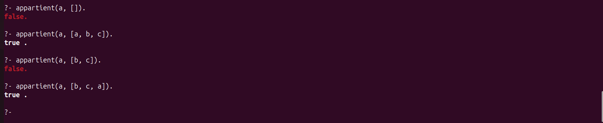

# Lab 1

## Exo 1

### Q1
```
appartient(X, [X|_]).
appartient(X, [_ , Y|L]) :- appartient(X, [Y|L]).
```


#### Q6
`substitue(2, 6, [2, 3, 2, 6, 7, 8, 2, 9], L).`

#### Q11
```
?- npair([1, 2, 3]).
false.

?- npair([1, 2]).
true.

?- npair([]).
true.
```